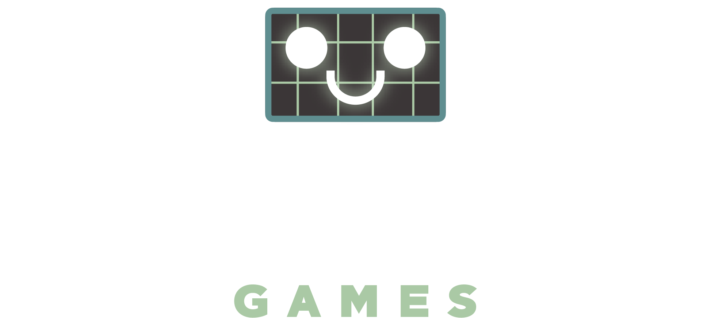
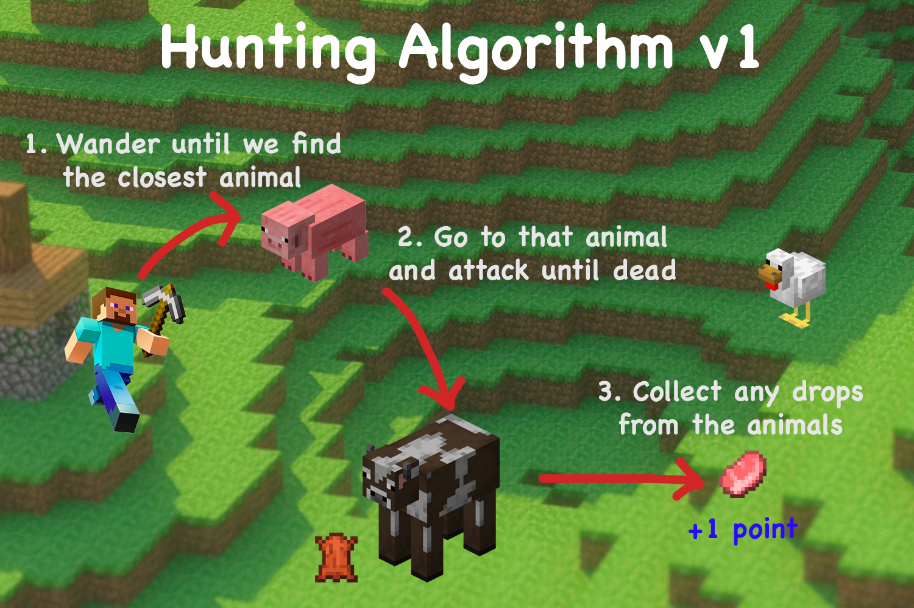

# Building an animal-hunting bot in Minecraft 

In this tutorial, we will be building a bot on Regression Games to hunt animals
in Minecraft for our [Ultimate Collector](https://play.regression.gg/documentation/welcome#season-0-ultimate-collector)
challenge!

Regression Games is an AI gaming competition platform - players compete in games
like Minecraft for prizes and top spots on the leaderboard. In this turorial,
players will write an algorithm for a bot to collect resources from animals,
which are worth points.

# Requirements to get started

* A GitHub account (you can create one [here](https://github.com))
* A Minecraft account (Java Edition) with `release 1.18.2` installed from the launcher (download launcher from [here](https://www.minecraft.net/en-us/download), and see [here](https://help.minecraft.net/hc/en-us/articles/360034754852-Change-Game-Version-for-Minecraft-Java-Edition) for changing your version)
* A Regression Games account - create one [here](https://play.regression.gg), and go through the setup flow to connect your GitHub account and Minecraft account.
* Your GitHub account should be connected to Replit - you can do that [here](https://replit.com/account#connected-services).

Let's get started! Let's open [index.js](#index.js)

> For an example of a completed template see [final_code.js](#final_code.js)

> Run into an issue? Send a message in our [Discord](https://discord.gg/925SYVse2H)!