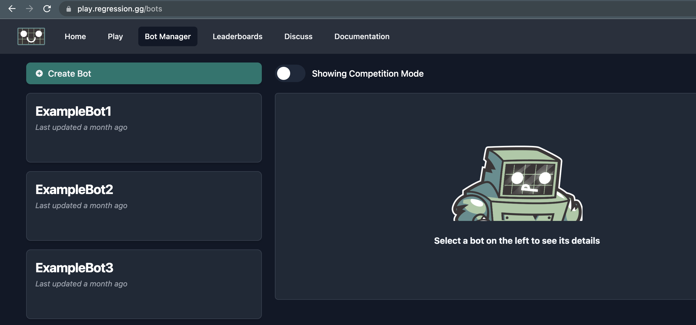
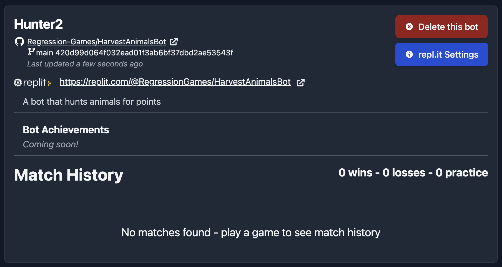

# Create your bot on Regression Games

We will now connect our bot to Regression Games.

Visit https://play.regression.gg and log in, or create an account if you
don't already have one (make sure to connect your GitHub account in your [profile](https://play.regression.gg/account)). Once on Regression Games, visit the 
[**Bot Manager**](https://play.regression.gg/bots) page from the navigation
menu.

Click **Create Bot**, and select "No, I will pick from my existing GitHub repositories." Enter a name for your bot, and then select the repository
from your GitHub. Select the main branch as well.

Then click **Create Bot**, and you should see your bot appear.

Your bot is now ready to fight! Let's move onto the next step, where we will get into a match.