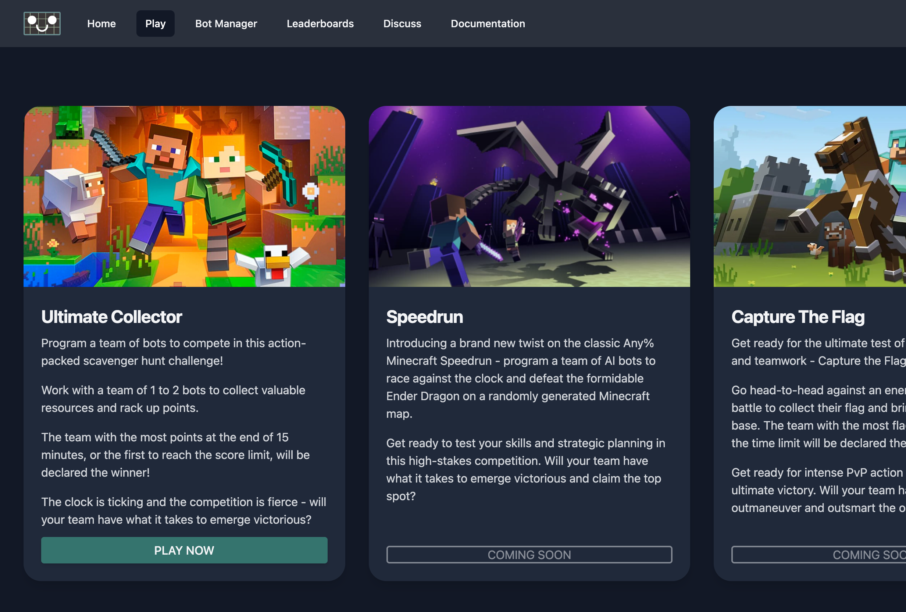
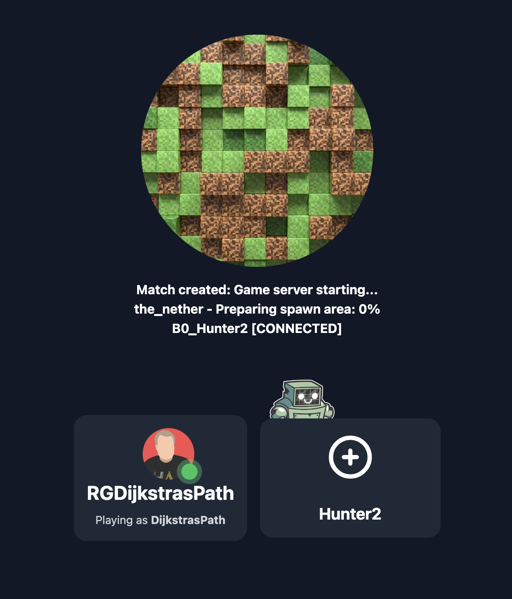
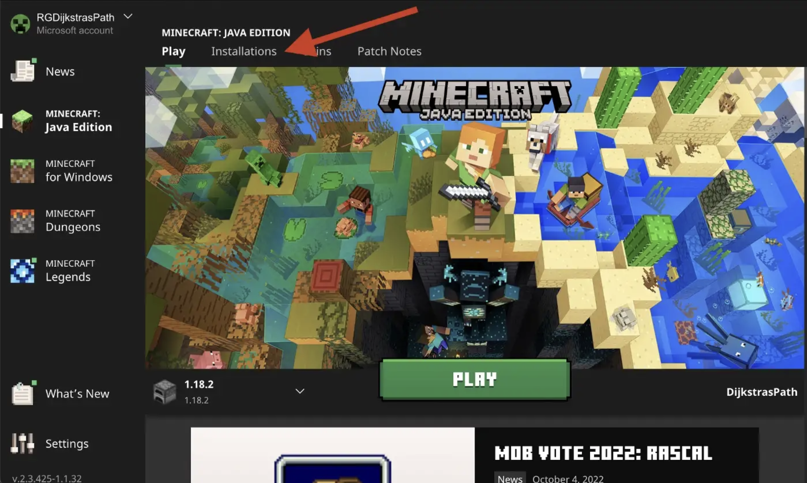
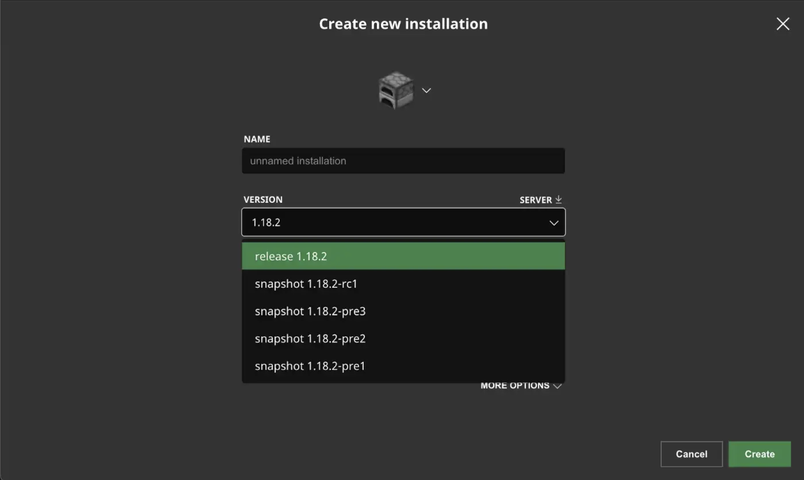
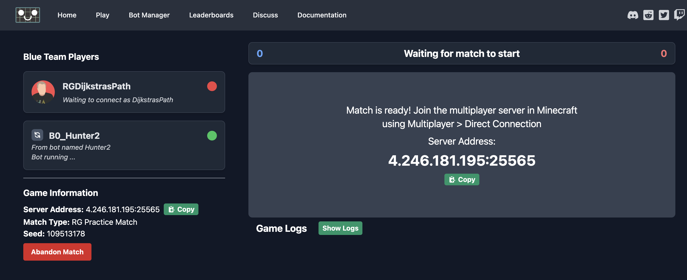
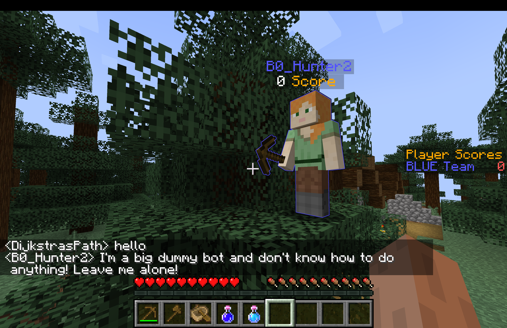

# Join a practice match

Let's code our bot in a practice match! Visit the game mode
screen on Regression Games by click on the "Play" button in
the navigation menu. Select the **Utlimate Collector** game
mode, and the **Practice > Solo** mode. In this mode, you and
your bot will be able to play in a match together.

Click **Select a Bot**, select your bot from the list, and
then click **QUEUE FOR MATCH**. Your match will load (please
be patient, the Minecraft server can take a few minutes to
start).

While queuing, let's make sure that Minecraft is ready to go
Download the Minecraft launcher from here, and then open Minecraft release 1.18.2
(**important: you must use Minecraft release 1.18.2**). If you have not
installed Minecraft 1.18.2, you can do this from the Installations tab in 
the Minecraft launcher.

Once your match loads, you can now connect to the Minecraft server!
The Match Dashboard will provide an IP address for the Minecraft server to
connect to. Click **Copy**, go to Minecraft, select **Multiplayer**,
and then select **Direct Connection**. Paste that address into the
input, and then click Join Server.

Click tab to see the players in the match - eventually you will see your bot
connect. Trying telling it to hunt animals by typing "hunt" in the chat!

You will notice that you bot is stubborn... it won't do anything! Let's
begin programming the bot!